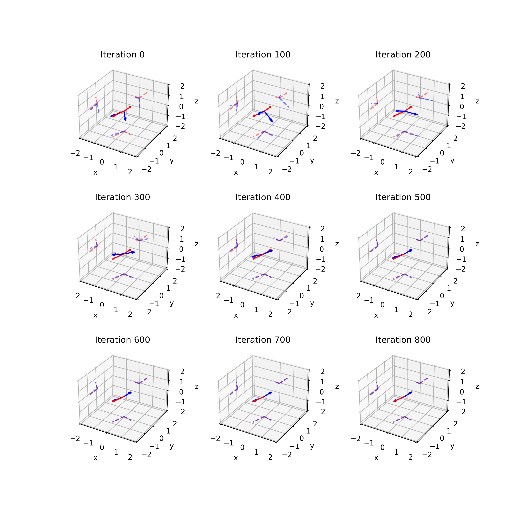
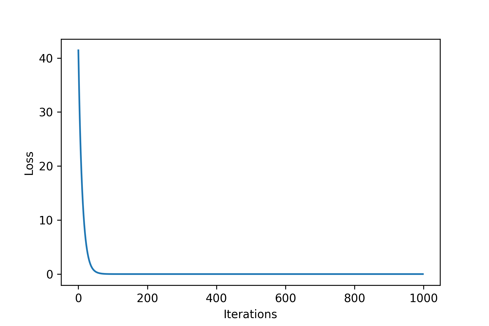
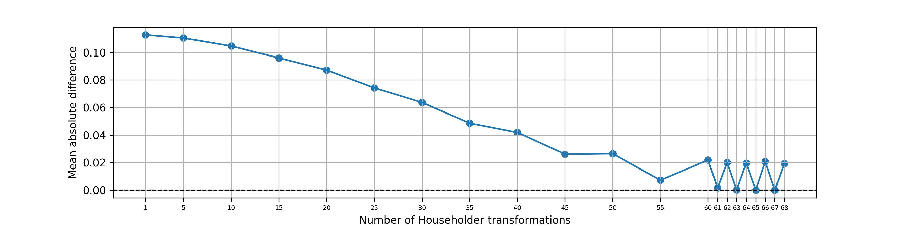
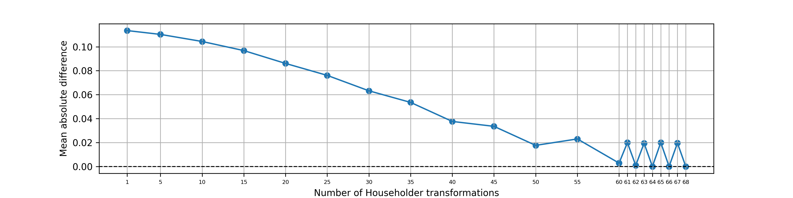

# DIOR

This is a PyTorch implementation of two ways of achieving differentiable reparameterization of orthogonal matrices.

I developed this small side project while trying to implement Orthogonal and Householder Sylvester flows.

"DIOR" (cool name, right?) stands for "DIfferentiable ORthogonalization".

## Method 1: iterative

The iterative procedure:

$$Q^{(k+1)} = Q^{(k)} (I + \frac{1}{2} (I - Q^{(k) T} Q^{(k)}))$$

This method only works for tall matrices (number of rows > number of columns) with orthogonal columns. Let $D$ and $M$ denote the number of rows and columns respectively. It can also work when $D=M$ but, empirically speaking, convergence is not guaranteed.

### Experiment 1: reconstructing a 3-by-2 orthogonal matrix

Here $D=3$ and $M=2$.



Legend:
- Red: target orthogonal vectors
- Blue: fitted orthogonal vectors (always orthogonal!)

### Experiment 2: reconstructing a 64-by-20 orthogonal matrix

Here $D=64$ and $M=20$.



## Method 2: composing Householder reflections

The Householder reflection (also called the Householder transformation):

$$H(\mathbf{z}) = (I - \frac{\mathbf{v} \mathbf{v}^T}{||\mathbf{v}||^2}) \mathbf{z} $$

In the Sylvester flows paper, there was this quote: "It can be shown that any $M \times M$ orthogonal matrix can be written as the product of $M-1$ Householder transformations." Unfortunately, I think it is wrong. 

```bibtex
@article{uhlig2001constructive,
  title={Constructive ways for generating (generalized) real orthogonal matrices as products of (generalized) symmetries},
  author={Uhlig, Frank},
  journal={Linear Algebra and its Applications},
  volume={332},
  pages={459--467},
  year={2001},
  publisher={Elsevier}
}
```

This paper contains a very important theorem on decomposing orthogonal matrices into Householder transformations. 

**Theorem 2.** Every real orthogonal $n \times n$ matrix $U$ is the product of $n − m$ real orthogonal Householder matrices for $m = dim ( ker( U − I_n )) $.

Clearly, $m$ could be anywhere between $0$ and $n$ (if $U = I_n$) inclusive. If $m=0$, then $U$ would require $n$ Householder transformations, not $n-1$. Sure, the Sylvester flow paper was off by one, but what's the big deal? 

Let's assume $n-m < n -1$. Such a $U$ would require fewer than $n-1$ Householder transformations according to the theorem. Sure, but what would be the harm of using $n-1$ transformations (more than required)? Well, considering the fact that an odd number of Householder transformations cannot form the identity matrix, the difference between $n-m$ and $n-1$ must be an even number for $n-1$ transformations to work. 

Below are experiments that verify this for $n=64$. Empirically, a random orthogonal matrix with $n=64$ is equally likely to have $n-m=63$ or $n-m=64$. Surprising!

Case 1 ($n=64$, $n-m=63$):



Case 1 ($n=64$, $n-m=64$)


