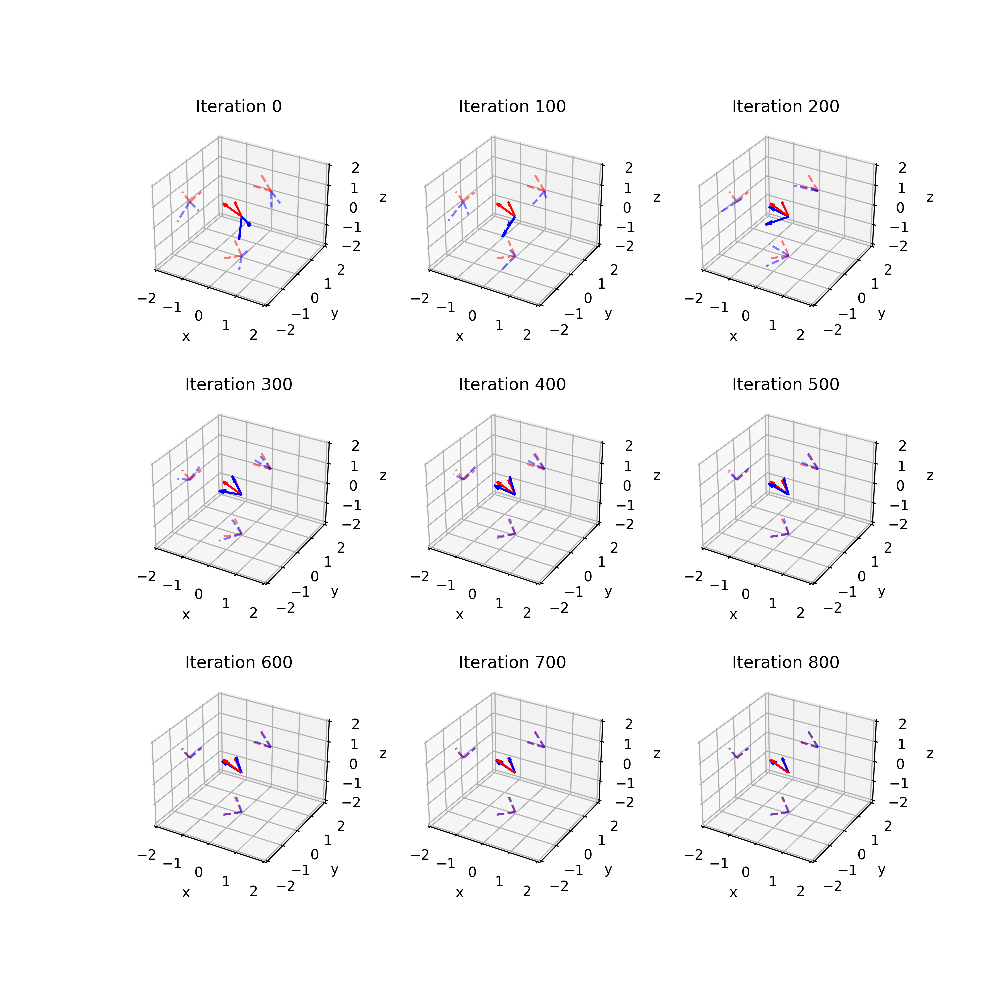
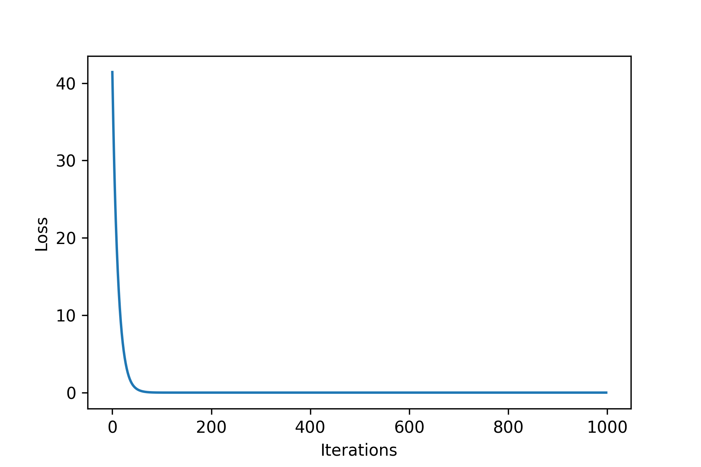

# dior

This is a PyTorch implementation of differentiable reparameterization of tall matrices with orthogonal columns.

I developed this small side project while trying to implement Orthogonal Sylvester flows.

"dior" stands for "differentiable iterative orthogonalization".

## Task 1: low-dimensional

See `dior.py` and `example.ipynb`. Here $D=3$ and $M=2$.

Legend:
- Red: target orthogonal vectors
- Blue: fitted orthogonal vectors (always orthogonal!)

## Task 2: high-dimensional

See `dior.py` and `example.ipynb`. Here $D=64$ and $M=20$.

