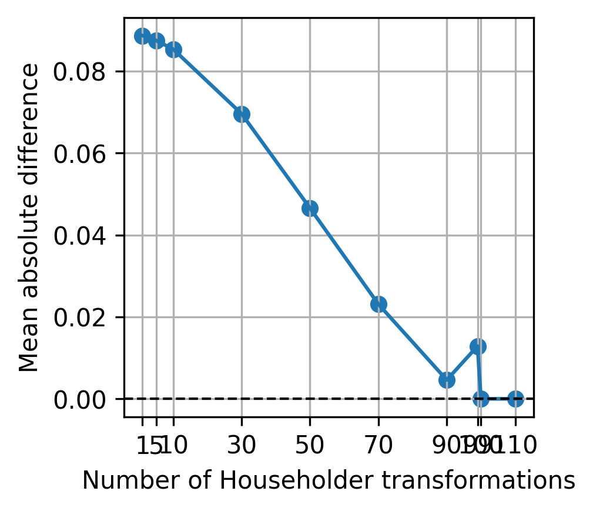
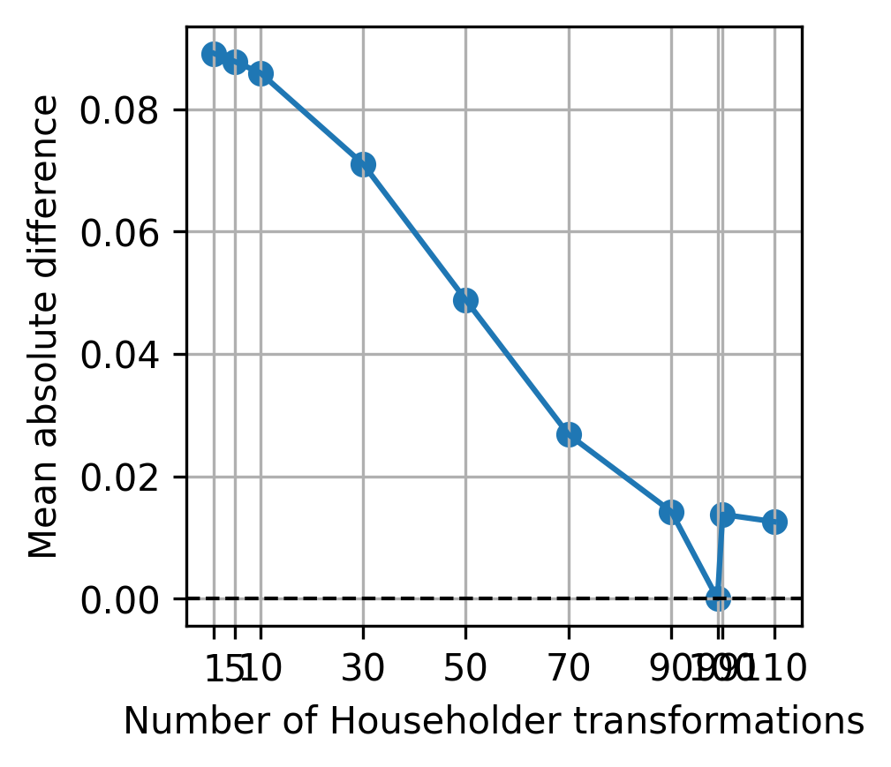

# DIOR

This is a PyTorch implementation of two ways of achieving differentiable reparameterization of orthogonal matrices.

I developed this small side project while trying to implement Orthogonal and Householder Sylvester flows.

"DIOR" (cool name, right?) stands for "DIfferentiable ORthogonalization".

## Method 1: iterative

This method only works for tall matrices (number of rows > number of columns) with orthogonal columns. Let $D$ and $M$ denote the number of rows and columns respectively. It can also work when $D=M$ but, empirically speaking, convergence is not guaranteed.

$$Q^{(k+1)} = Q^{(k)} (I + \frac{1}{2} (I - Q^{(k) T} Q^{(k)}))$$

### Experiment 1: reconstructing a 3-by-2 orthogonal matrix

Here $D=3$ and $M=2$.

Legend:
- Red: target orthogonal vectors
- Blue: fitted orthogonal vectors (always orthogonal!)

### Experiment 2: reconstructing a 64-by-20 orthogonal matrix

Here $D=64$ and $M=20$.

## Method 2: composing Householder reflections

"It can be shown that any $M \times M$ orthogonal matrix can be written as the product of $M-1$ Householder transformations." 

### Experiment: reconstructing a 64-by-64 orthogonal matrix

Although the mean (averaged over the 64 times 64 entries) absolute difference tends to decrease as the number of Householder transformations ($H$) increases, we see that convergence is not always reached when $H$ is large. Below are 5 different seeds.

|  |  |  |  |  |
| ------------------------------------------------------- | ------------------------------------------------------- | ------------------------------------------------------- | ------------------------------------------------------- | ------------------------------------------------------- |

